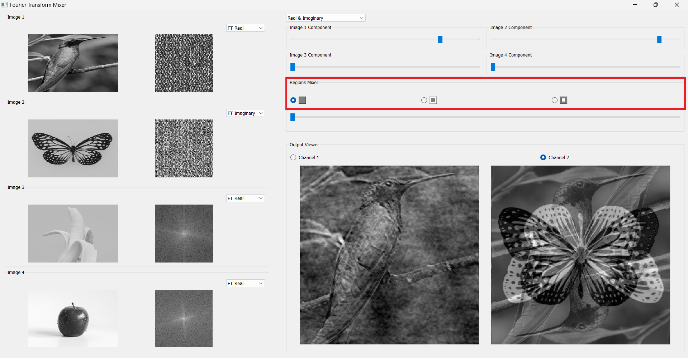

# Signal Components Emphasizer

Welcome to the Signal Components Emphasizer! This desktop application is designed to illustrate the importance of magnitude and phase components in a 2D signal (image). Explore the features below to understand how different contributions to the signal can be emphasized, mixed, and visualized.

## Table of Contents

1. [Images Viewers](#images-viewers)
   - [Open and View Images](#open-and-view-images)
   - [Conversion to Grayscale](#conversion-to-grayscale)
   - [FT Components Display](#ft-components-display)
   - [Easy Browse](#easy-browse)

2. [Output Ports](#output-ports)
   - [Mixer Result Visualization](#mixer-result-visualization)

3. [Brightness/Contrast](#brightness-contrast)

4. [Components Mixer](#components-mixer)
   - [Customized Weights](#customized-weights)

5. [Regions Mixer](#regions-mixer)
   - [Region Selection](#region-selection)

## Images Viewers

### Open and View Images

1. **Image Opening:** Open and view up to four grayscale images simultaneously.
### Conversion to Grayscale

2. **Color Conversion:** Convert colored images to grayscale upon opening.

### FT Components Display

4. **FT Components Display:** Display two components for each image - fixed display for the image and a switchable display for FT Magnitude, FT Phase, FT Real, and FT Imaginary components.

### Easy Browse

5. **Easy Browse:** Change any image by double-clicking its viewer (Browse function).

## Output Ports

### Mixer Result Visualization

6. **Mixer Result:** Display the mixer result in one of two output viewports, each similar to the input image viewport.

## Brightness/Contrast

7. **Brightness/Contrast Adjustment:** Change the brightness/contrast (window/level) of any image viewport using mouse dragging, applicable to all four components.

## Components Mixer

### Customized Weights

8. **Customized Weights:** Customize the weights of each image's FT components using sliders. Intuitive user interface for weight adjustments.

## Regions Mixer

### Region Selection

9. **Region Selection:** Pick regions for each FT component - inner region (low frequencies) or outer region (high frequencies). Use a customizable rectangle, with the option to include the inner or outer region. The selected region is highlighted for all four images.

------

